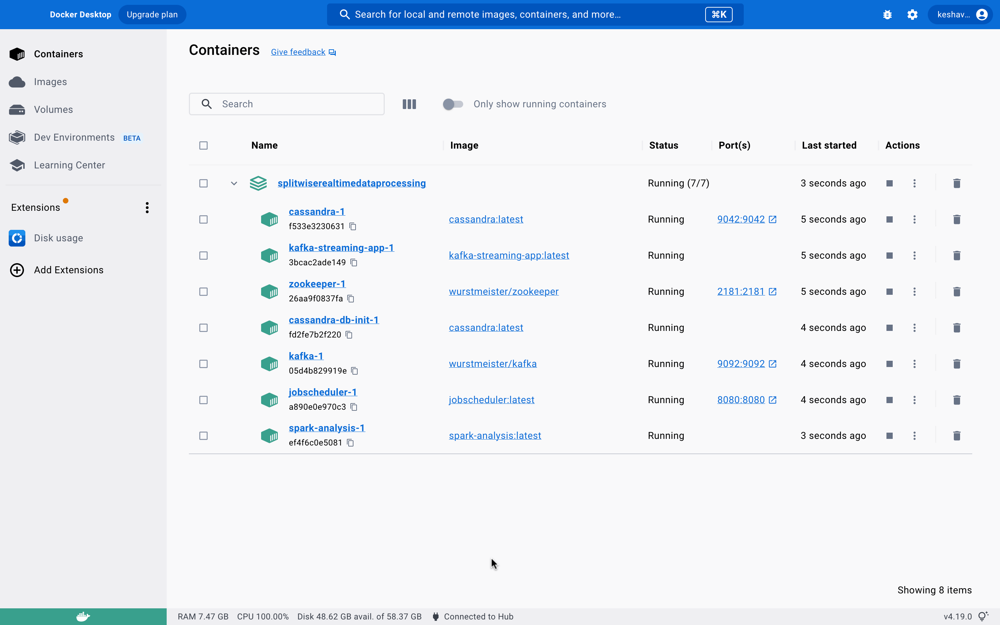
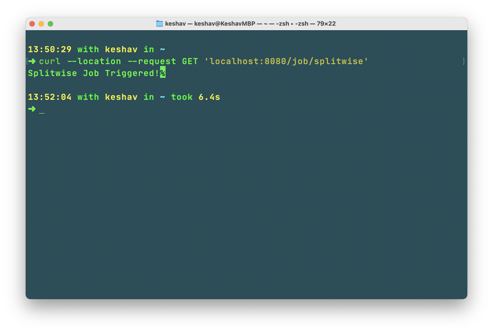
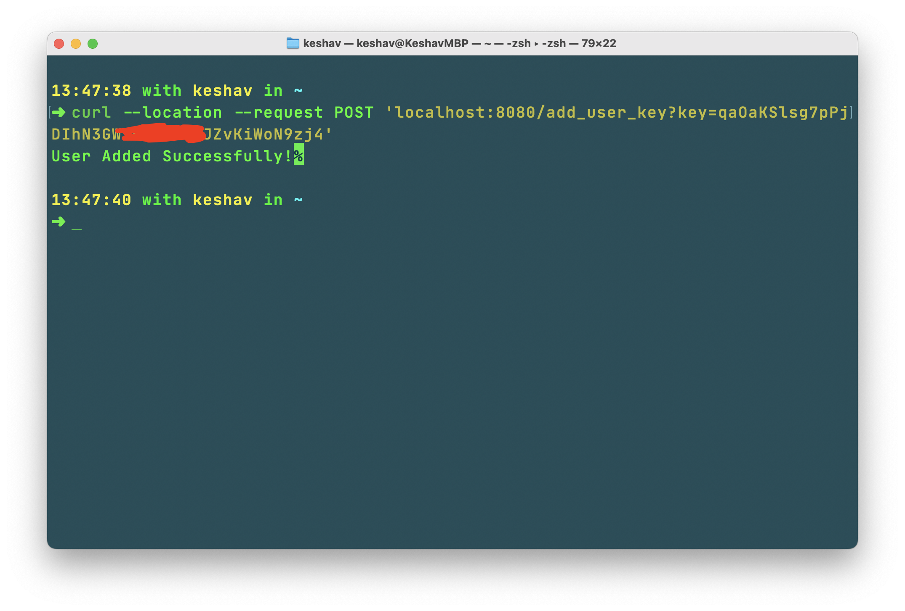

## Real time Processing of Splitwise Data using Bigdata Technologies

# Introduction

Splitwise is a free tool for friends and roommates to track bills and other shared expenses, so that everyone gets paid
back. On the other hand, Big data is a term that describes the large volume of data – both structured and unstructured –
that inundates a business on a day-to-day basis. But it’s not the amount of data that’s important. It’s what
organizations do with the data that matters. Big data can be analyzed for insights that lead to better decisions and
strategic business moves.

This is project to demonstrate the use of multiple big data technologies to process the splitwise data in real time. The
project is divided into two parts. The first part is to process the data in real time and the second part is to process
the data in batch mode. The project is implemented using Kafka, Spark, Spring Boot, Cassandra, Docker, Docker Compose.

## Architecture


## Technologies Used

- Kafka
- Spark
- Spring Boot
- Cassandra
- Docker
- Docker Compose
- Gradle
- SBT
- Scala
- Kotlin
- CQL

## How to run the project

### Prerequisites
- Docker

### Steps to run the project

- Clone the project
- Go to the project directory
- Run the following command to start the project
```shell
docker build -t jobscheduler ./scheduler
docker build -t spark-analysis ./sparkanalysis
docker build -t kafka-streaming-app ./kafka-streaming-app
``` 
This will build the docker images for the project.
- Run the following command to start the project
```shell
docker-compose up -d
```

Docker Desktop should look like this


- Wait for 60 seconds to let the cassandra and kafka to start
- cassandra-init service is expected to stop after 65 seconds (depends on system speed), and init the cassandra database, if it stopped and the
  database is not initialized, run init service again and wait for 60 seconds. ( only required for the first time )
- After Cassandra service started and inited successfully, start jobscheduler service then
- Use the below command to add a splitwise user to the system
```shell
curl --location --request POST 'localhost:8080/add_user_key?key=<splitwise-api-key>' \
--data ''
```
> Splitwise api key can be generated [here](https://secure.splitwise.com/apps/new)
- Start Kafka-streaming-app service and trigger scheduler application using the below command
```shell
curl --location --request GET 'localhost:8080/job/splitwise'
```

- This will trigger the scheduler application to fetch the data from splitwise and push it to kafka
- Kafka-streaming-app service will consume the data from kafka and process it and push it to cassandra
- You can start the sparkanalysis service to get the reports generated in [output](./output) folder

- Spark Analysis service will stop automatically after reports are generated


 
